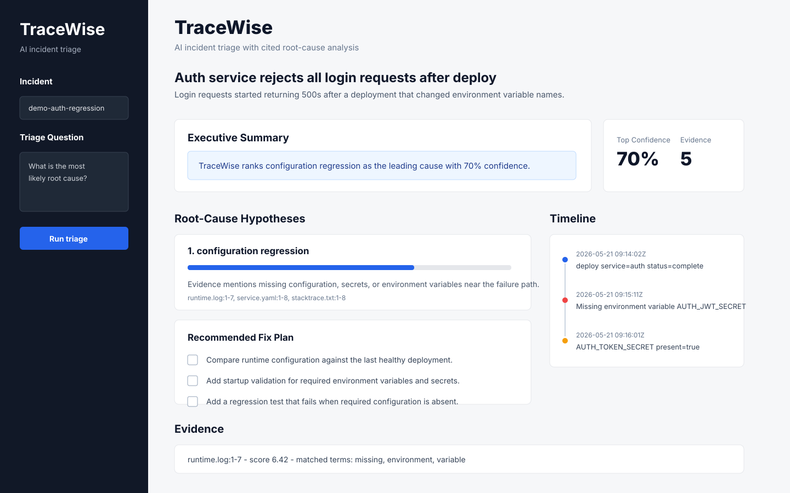

# TraceWise

TraceWise is an AI incident triage agent that investigates logs, stack traces, test output, config files, and code evidence to produce cited root-cause analysis.

The project is designed as an internship-grade AI engineering portfolio piece: practical, testable, evaluation-driven, and easy to demo.



## What It Does

Given an incident bundle, TraceWise:

1. Loads logs, stack traces, code, config, and reproduction output.
2. Chunks artifacts with line-aware citation metadata.
3. Retrieves relevant evidence with a local keyword retriever.
4. Ranks likely root-cause hypotheses.
5. Builds a timestamped incident timeline.
6. Returns a recommended fix plan grounded in cited artifacts.
7. Evaluates root-cause accuracy on demo incident benchmarks.

## Demo Incidents

The repo includes two ready-to-run incident bundles:

- `demo-auth-regression`: login failures caused by a missing renamed secret.
- `demo-payment-timeout`: checkout failures caused by an upstream payment gateway timeout.

## Quickstart

Create an environment and install dependencies:

```bash
python3 -m venv .venv
source .venv/bin/activate
pip install -e ".[dev]"
```

Run the core test suite:

```bash
python -m pytest
```

Run triage on a demo incident:

```bash
python -m tracewise.analysis.cli incidents/demo-auth-regression
```

Run the benchmark:

```bash
python -m tracewise.evals.cli eval_cases.json
```

Expected benchmark result:

```text
root_cause_accuracy: 1.0
```

## Dashboard Demo

Launch the Streamlit dashboard:

```bash
streamlit run tracewise/ui/streamlit_app.py
```

The dashboard lets you choose a demo incident and inspect:

- executive summary
- ranked root-cause hypotheses
- confidence scores
- citations
- incident timeline
- recommended fix checklist
- retrieved evidence chunks

See [docs/demo-script.md](docs/demo-script.md) for a short walkthrough.

## Case Study

`demo-auth-regression` simulates a login outage after deployment. TraceWise connects three artifacts:

- `runtime.log`: login requests fail because `AUTH_JWT_SECRET` is missing
- `stacktrace.txt`: token signing fails inside the auth flow
- `service.yaml`: production still provides the old `AUTH_TOKEN_SECRET`

The top-ranked hypothesis is:

```text
configuration regression
```

This is the core product promise: TraceWise does not just summarize logs. It turns messy incident evidence into a cited, testable root-cause hypothesis.

See [docs/case-study.md](docs/case-study.md) for the full walkthrough.

## API

Start the FastAPI server:

```bash
uvicorn tracewise.api.app:app --reload
```

Health check:

```bash
curl http://127.0.0.1:8000/health
```

## Project Structure

```text
.github/        CI workflow for tests and benchmark checks
tracewise/
  api/          FastAPI app and request models
  analysis/     root-cause ranking, timeline extraction, CLI
  core/         typed domain models
  evals/        benchmark CLI
  ingestion/    incident loading and line-aware chunking
  retrieval/    local evidence retrieval
incidents/      demo incident bundles
tests/          focused unit and behavior tests
docs/           architecture and project notes
```

## Why This Project Stands Out

TraceWise is not just a chatbot wrapper. It demonstrates the skills recruiters expect from applied AI interns:

- Retrieval over messy real-world artifacts
- Grounded outputs with citations
- Deterministic evaluation
- Backend API design
- Typed Python models
- Tests around core behavior
- Clear product framing

## Portfolio Resume Bullet

> Built TraceWise, an AI incident triage agent that analyzes logs, stack traces, config, and code to produce cited root-cause hypotheses, incident timelines, and fix plans, with a benchmark suite measuring root-cause accuracy.

## Continuous Integration

The GitHub Actions workflow runs:

- package install
- unit and API tests
- evaluation benchmark

This keeps the demo honest as the project grows.

## Roadmap

- Add vector retrieval with embeddings.
- Add a React dashboard for timeline and evidence review.
- Add GitHub Actions integration for failing CI logs.
- Add LLM-based synthesis while preserving citation requirements.
- Add patch proposal mode with generated regression tests.
